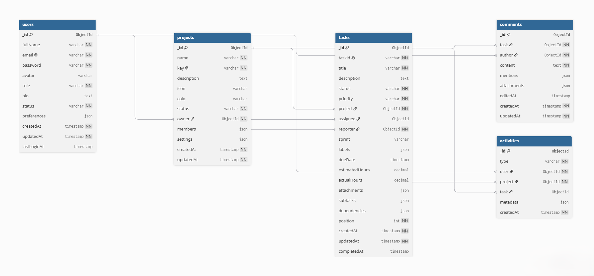

# TaskMatrix - Agile Project Management Platform

## 📋 Product Requirements Document (PRD)

### Project Overview
**TaskMatrix** is an enterprise-grade Agile Project Management platform for modern software development teams. Inspired by Jira and Asana, it provides task tracking, team collaboration, and sprint management with real-time updates.

### 🎯 Designated Track
**Fullstack Engineering**

---

## 🛠️ Tech Stack

### Frontend
- **Framework**: Next.js 14 (App Router)
- **Language**: TypeScript
- **Styling**: Tailwind CSS + Shadcn UI
- **State Management**: Zustand + React Query
- **Drag & Drop**: @dnd-kit/core
- **Form Handling**: React Hook Form + Zod
- **Charts & Analytics**: Recharts

### Backend
- **Runtime**: Node.js 20+
- **Framework**: Express.js
- **Language**: TypeScript
- **Authentication**: JWT + bcrypt
- **Real-time**: Socket.io
- **Validation**: Zod

### Database
- **Primary Database**: MongoDB (Atlas)
- **ODM**: Mongoose
- **Caching**: Redis (Optional for Phase 2)

### DevOps & Deployment
- **Frontend Hosting**: Vercel
- **Backend Hosting**: Railway / Render
- **Database**: MongoDB Atlas
- **Version Control**: Git + GitHub
- **CI/CD**: GitHub Actions

---

## ✨ Core Features (Prioritized)

### P0 - MVP (Sprint 14)
1. **User Authentication & Authorization**
   - User registration with email verification
   - Secure login/logout with JWT tokens
   - Password reset functionality
   - Role-based access control (Admin, Project Manager, Developer, Viewer)

2. **Project Management**
   - Create, read, update, delete projects
   - Project overview dashboard
   - Project members management
   - Project status tracking (Active, On Hold, Completed, Archived)

3. **Basic Task Management**
   - Create tasks with title, description, priority
   - Assign tasks to team members
   - Task status workflow (To Do, In Progress, In Review, Done)
   - Task priority levels (Low, Medium, High, Critical)
   - Task detail view with full information

### P1 - Core Features (Sprint 15)
4. **Advanced Kanban Board**
   - Drag-and-drop task cards between status columns
   - Visual task cards with assignee avatars, labels, and due dates
   - Swimlane views (by assignee, priority, or sprint)
   - Quick edit functionality on cards
   - Filter and search capabilities

5. **Task Details & Relationships**
   - Task comments and discussion threads
   - File attachments (images, documents)
   - Task labels/tags with color coding
   - Sub-tasks and checklist items
   - Task dependencies (blocked by, blocks)
   - Time tracking (estimated vs actual hours)
   - Sprint field (text: "Sprint 1", "Q1 2026", etc.)

6. **Team Collaboration**
   - User profiles with avatars
   - @mentions in comments
   - Activity feed per task
   - Team member availability status

### P2 - Advanced Features (Sprint 16)
7. **Real-time Updates**
   - Live task updates via Socket.io
   - Real-time activity feed
   - Online user presence indicators
   - Instant notifications for task assignments and mentions

8. **Analytics & Reporting**
   - Project dashboard with KPI widgets
   - Task completion metrics
   - Team performance analytics
   - Burndown/burnup charts
   - Export reports to PDF/CSV

9. **Notifications System**
   - In-app notification center (from activity feed)
   - Email notifications for critical updates
   - Notification preferences management

10. **Advanced Search & Filters**
    - Global search across all projects
    - Advanced filtering (assignee, label, status, priority, date range)
    - Saved filter presets
    - Recent searches history

### P3 - Enhancement Features (Post-MVP)
11. **Sprint Management (Enhanced)**
    - Dedicated sprints collection
    - Sprint creation and management
    - Sprint velocity tracking
    - Burndown charts

12. **Automation & Workflows**
    - Automated task assignment rules
    - Status transition automation
    - Scheduled task creation
    - Custom workflow templates

13. **Integrations**
    - GitHub/GitLab commit linking
    - Slack notifications
    - Google Calendar sync
    - Export/Import functionality (JSON, CSV)

---

## 🎨 UI/UX Wireframes

### Design System
- **Color Palette**: Professional blue-gray theme with accent colors for task priorities
- **Typography**: Inter font family for optimal readability
- **Layout**: Sidebar navigation + main content area
- **Responsive Breakpoints**: Mobile (< 640px), Tablet (640-1024px), Desktop (> 1024px)

### Core Viewports

#### 1. Authentication Screen (Desktop & Mobile)
**Desktop (1440x1024)**:
- Clean, centered login/register forms (max-width 480px)
- Email + password fields with validation feedback
- "Remember me" checkbox
- Password visibility toggle
- OAuth integration placeholders (Google, GitHub)
- Forgot password link

**Mobile (375x812)**:
- Full-width centered card with padding
- Stacked form inputs (full width)
- Larger touch targets (48px minimum)
- Bottom-aligned action buttons
- Simplified OAuth buttons (icon + text)

#### 2. Main Dashboard (Desktop & Mobile)
**Desktop (1440x1024)**:
- Left sidebar with navigation (Dashboard, Projects, My Tasks, Team, Analytics)
- Top bar with search, notifications, user profile dropdown
- Dashboard widgets in responsive grid (3 columns):
  - Active projects grid
  - My assigned tasks (quick view)
  - Recent activity timeline
  - Sprint progress overview
  - Team workload distribution chart

**Mobile (375x812)**:
- Hamburger menu (sidebar collapses)
- Top bar with logo, search icon, notification icon, profile avatar
- Widgets stack vertically (1 column)
- Swipeable cards for project navigation
- Sticky top navigation bar

#### 3. Kanban Board View (Desktop & Mobile)
**Desktop (1440x1024)**:
- Full-width board with horizontal scrolling
- Status columns: To Do, In Progress, In Review, Done (side by side)
- Task cards displaying:
  - Task ID and title
  - Assignee avatar
  - Priority indicator (color-coded)
  - Labels/tags
  - Due date with urgency indicator
  - Comments count
  - Attachments icon
- Drag-and-drop visual feedback
- Column headers with task count
- Quick add task button per column
- Board settings (filters, grouping, sort)

**Mobile (375x812)**:
- Horizontal swipe between status columns
- Tab navigation for status columns (one column visible at a time)
- Simplified task cards (reduced metadata)
- Tap to expand card details
- Floating action button (FAB) for adding tasks
- Bottom sheet for filters and settings
- Touch-optimized drag gesture (long press + drag)

#### 4. Task Detail Modal/Page
- Full task information in a centered modal or dedicated page
- Left panel:
  - Task title (editable inline)
  - Description with markdown support
  - Attachments section with upload
  - Sub-tasks checklist
  - Comments thread with @mentions
- Right sidebar:
  - Status dropdown
  - Priority selector
  - Assignee selector with search
  - Labels multi-select
  - Due date picker
  - Time tracking inputs
  - Task relationships (dependencies)
  - Activity log

#### 5. Project Settings Page
- Tabbed interface:
  - General (name, description, status)
  - Members (add/remove, role management)
  - Sprints (create, view, archive)
  - Labels (create custom labels with colors)
  - Automation rules
- Action buttons (Save, Cancel, Delete Project)

### Figma Design Link
🔗 **[View Full Wireframes on Figma](https://www.figma.com/design/Kt67HHusy6iEwaUMkG4nsf/TaskMatrix---Week-13-Wireframes?node-id=0-1&t=EhEqNssjpA1d0xel-1)**

---

## 🏗️ System Architecture

### Entity Relationship Diagram (ERD)

Database schema for TaskMatrix showing relationships between 5 collections:



### Database Collections (5 Core Collections)

#### 1. Users Collection
```javascript
{
  _id: ObjectId,
  fullName: String,
  email: String (unique, indexed),
  password: String (hashed),
  avatar: String (URL),
  role: String (enum: ['admin', 'project_manager', 'developer', 'viewer']),
  bio: String,
  status: String (enum: ['online', 'away', 'busy', 'offline']),
  preferences: {
    emailNotifications: Boolean,
    theme: String (enum: ['light', 'dark', 'system'])
  },
  createdAt: Date,
  updatedAt: Date,
  lastLoginAt: Date
}
```

#### 2. Projects Collection
```javascript
{
  _id: ObjectId,
  name: String (indexed),
  key: String (unique, e.g., 'TASK' for TASK-101),
  description: String,
  icon: String,
  color: String,
  status: String (enum: ['active', 'on_hold', 'completed', 'archived']),
  owner: ObjectId (ref: Users),
  members: [{
    user: ObjectId (ref: Users),
    role: String (enum: ['admin', 'member', 'viewer']),
    joinedAt: Date
  }],
  settings: {
    allowPublicView: Boolean,
    requireApproval: Boolean
  },
  createdAt: Date,
  updatedAt: Date
}
```

#### 3. Tasks Collection
```javascript
{
  _id: ObjectId,
  taskId: String (unique, e.g., 'TASK-101'),
  title: String (indexed),
  description: String,
  status: String (enum: ['todo', 'in_progress', 'in_review', 'done']),
  priority: String (enum: ['low', 'medium', 'high', 'critical']),
  project: ObjectId (ref: Projects, indexed),
  assignee: ObjectId (ref: Users, indexed),
  reporter: ObjectId (ref: Users),
  sprint: String (e.g., 'Sprint 1', 'Q1 2026'),
  labels: [String],
  dueDate: Date (indexed),
  estimatedHours: Number,
  actualHours: Number,
  attachments: [{
    filename: String,
    url: String,
    uploadedBy: ObjectId (ref: Users),
    uploadedAt: Date
  }],
  subtasks: [{
    title: String,
    completed: Boolean
  }],
  dependencies: {
    blockedBy: [ObjectId] (ref: Tasks),
    blocks: [ObjectId] (ref: Tasks)
  },
  position: Number (for ordering within status column),
  createdAt: Date,
  updatedAt: Date,
  completedAt: Date
}
```

#### 4. Comments Collection
```javascript
{
  _id: ObjectId,
  task: ObjectId (ref: Tasks, indexed),
  author: ObjectId (ref: Users),
  content: String,
  mentions: [ObjectId] (ref: Users),
  attachments: [{
    filename: String,
    url: String
  }],
  editedAt: Date,
  createdAt: Date,
  updatedAt: Date
}
```

#### 5. Activities Collection
```javascript
{
  _id: ObjectId,
  type: String (enum: ['task_created', 'task_updated', 'task_assigned', 'comment_added', 'status_changed', 'member_added']),
  user: ObjectId (ref: Users, indexed),
  project: ObjectId (ref: Projects, indexed),
  task: ObjectId (ref: Tasks, optional, indexed),
  metadata: {
    field: String,
    oldValue: String,
    newValue: String,
    comment: String
  },
  createdAt: Date (indexed, TTL: 90 days)
}
```

### Key Relationships
- **Users → Projects**: One-to-Many (one user can own multiple projects)
- **Projects → Tasks**: One-to-Many (one project contains multiple tasks)
- **Users → Tasks**: Many-to-Many (users can be assigned to multiple tasks)
- **Tasks → Comments**: One-to-Many (one task has multiple comments)
- **Users → Comments**: One-to-Many (one user creates multiple comments)
- **Tasks → Activities**: One-to-Many (one task generates multiple activities)
- **Users → Activities**: One-to-Many (one user performs multiple actions)

**Note**: Sprints are handled as string fields in tasks (e.g., "Sprint 1", "Q1 2026") for MVP simplicity. Can be extracted to separate collection in Phase 2 if needed.

### Database Indexes Strategy
- **Users**: email (unique), role
- **Projects**: name, owner, status
- **Tasks**: taskId (unique), project + status (compound), assignee, dueDate, priority
- **Comments**: task, createdAt
- **Activities**: user + createdAt (compound), project, task

---

## 🔐 API Architecture

### Authentication Endpoints
- `POST /api/auth/register` - User registration
- `POST /api/auth/login` - User login
- `POST /api/auth/logout` - User logout
- `POST /api/auth/refresh-token` - Refresh JWT token
- `POST /api/auth/forgot-password` - Initiate password reset
- `POST /api/auth/reset-password` - Complete password reset
- `GET /api/auth/me` - Get current user profile

### Project Endpoints
- `GET /api/projects` - List all accessible projects
- `POST /api/projects` - Create new project
- `GET /api/projects/:id` - Get project details
- `PUT /api/projects/:id` - Update project
- `DELETE /api/projects/:id` - Delete project
- `POST /api/projects/:id/members` - Add project member
- `DELETE /api/projects/:id/members/:userId` - Remove member
- `GET /api/projects/:id/analytics` - Get project analytics

### Task Endpoints
- `GET /api/projects/:projectId/tasks` - List project tasks
- `POST /api/projects/:projectId/tasks` - Create task
- `GET /api/tasks/:id` - Get task details
- `PUT /api/tasks/:id` - Update task
- `DELETE /api/tasks/:id` - Delete task
- `PATCH /api/tasks/:id/status` - Update task status
- `PATCH /api/tasks/:id/assign` - Assign task to user
- `POST /api/tasks/:id/attachments` - Upload attachment
- `GET /api/tasks/my-tasks` - Get current user's assigned tasks

### Comment Endpoints
- `GET /api/tasks/:taskId/comments` - List task comments
- `POST /api/tasks/:taskId/comments` - Add comment
- `PUT /api/comments/:id` - Update comment
- `DELETE /api/comments/:id` - Delete comment

### Activity Endpoints
- `GET /api/activities` - Get activity feed (with filters)
- `GET /api/projects/:projectId/activities` - Get project activity feed

### Real-time Events (Socket.io)
- `task:created` - New task created
- `task:updated` - Task updated
- `task:moved` - Task status changed
- `comment:added` - New comment added
- `user:online` - User status changed
- `notification:new` - New notification

---

## 📊 State Management Architecture

### Zustand Store Structure

```typescript
// Auth Store
interface AuthStore {
  user: User | null;
  token: string | null;
  isAuthenticated: boolean;
  login: (credentials) => Promise<void>;
  logout: () => void;
  updateProfile: (data) => Promise<void>;
}

// Project Store
interface ProjectStore {
  projects: Project[];
  currentProject: Project | null;
  setCurrentProject: (id) => void;
  addProject: (project) => void;
  updateProject: (id, data) => void;
  deleteProject: (id) => void;
}

// Task Store
interface TaskStore {
  tasks: Map<string, Task>; // Keyed by task ID
  tasksByProject: Map<string, string[]>; // Project ID -> Task IDs
  selectedTask: Task | null;
  filters: TaskFilters;
  updateTask: (id, data) => void;
  moveTask: (id, newStatus, newPosition) => void;
  setFilters: (filters) => void;
}

// UI Store
interface UIStore {
  sidebarOpen: boolean;
  theme: 'light' | 'dark' | 'system';
  notifications: Notification[];
  toggleSidebar: () => void;
  setTheme: (theme) => void;
  addNotification: (notification) => void;
}
```

### React Query Cache Keys
- `['auth', 'me']` - Current user
- `['projects']` - All projects
- `['projects', projectId]` - Single project
- `['projects', projectId, 'tasks']` - Project tasks
- `['tasks', taskId]` - Single task
- `['tasks', taskId, 'comments']` - Task comments
- `['notifications']` - User notifications
- `['activities']` - Activity feed

---

## 🚀 Development Roadmap

### Sprint 14 (Week 2): MVP Development
- Set up Next.js + Express project structure
- Implement authentication system (register, login, JWT)
- Create MongoDB schemas and models
- Build basic project CRUD operations
- Develop simple task management UI
- Deploy backend to Railway/Render
- Deploy frontend to Vercel

### Sprint 15 (Week 3): Full Feature Completion
- Implement drag-and-drop Kanban board
- Add sprint management functionality
- Build task detail page with comments
- Implement file upload system
- Create team collaboration features
- Add role-based access control
- Develop search and filter functionality

### Sprint 16 (Week 4): Advanced Features & Polish
- Integrate Socket.io for real-time updates
- Build analytics dashboard with charts
- Implement notification system
- Add email notifications
- Create activity feed
- UI/UX refinements and animations
- Mobile responsiveness optimization
- Performance optimization (lazy loading, caching)

### Sprint 17 (Week 5): Final Deployment & Testing
- Full testing (unit, integration, E2E)
- Bug fixes and stability improvements
- Documentation completion
- CI/CD pipeline setup with GitHub Actions
- Final production deployment
- Performance monitoring setup
- Demo video creation

---

## 🧪 Testing Strategy

### Unit Tests
- Authentication utilities
- Database models validation
- API endpoint handlers
- State management functions

### Integration Tests
- Complete auth flow
- Task creation and updates
- Project member management
- Sprint operations

### E2E Tests (Playwright/Cypress)
- User registration and login
- Create project and tasks
- Drag and drop tasks
- Add comments and attachments
- Real-time updates

---

## 📝 Deployment Checklist

- [ ] Environment variables configured
- [ ] MongoDB Atlas database provisioned
- [ ] Backend deployed to Railway/Render
- [ ] Frontend deployed to Vercel
- [ ] Custom domain configured (optional)
- [ ] SSL certificates active
- [ ] CORS configured properly
- [ ] Rate limiting implemented
- [ ] Error logging setup (Sentry)
- [ ] Analytics tracking (PostHog/GA)
- [ ] Performance monitoring active
- [ ] Backup strategy implemented

---

## 🔒 Security Considerations

1. **Authentication**: JWT tokens with httpOnly cookies, bcrypt password hashing
2. **Authorization**: Role-based access control on all sensitive endpoints
3. **Input Validation**: Zod schemas for all user inputs
4. **XSS Prevention**: Content sanitization, CSP headers
5. **CSRF Protection**: CSRF tokens for state-changing operations
6. **Rate Limiting**: Express rate limiter on API endpoints
7. **SQL Injection**: MongoDB parameterized queries via Mongoose
8. **File Upload**: File type validation, size limits, virus scanning
9. **HTTPS**: Enforce HTTPS in production
10. **Environment Variables**: Secure storage of secrets

---

## 📚 Documentation

- **API Documentation**: Swagger/OpenAPI specification
- **User Guide**: User manual with screenshots
- **Developer Guide**: Setup instructions, architecture overview
- **Deployment Guide**: Step-by-step deployment instructions
- **Contributing Guide**: Code standards, PR process

---

## 👥 Target Users

1. **Software Development Teams** (Primary)
   - Agile teams using Scrum/Kanban methodologies
   - Remote-first engineering organizations
   - Startups needing lightweight project management

2. **Project Managers**
   - Team leads coordinating multiple projects
   - Product owners managing backlogs

3. **Individual Developers**
   - Freelancers managing client projects
   - Open-source maintainers tracking issues

---

## 🎯 Success Metrics (KPIs)

- User registration and retention rate
- Average tasks created per project
- Daily active users (DAU)
- Task completion velocity
- Page load performance (< 2s initial load)
- API response time (< 200ms average)
- Zero critical security vulnerabilities
- Mobile responsiveness score (Lighthouse > 90)
- Successful real-time synchronization (< 1s latency)

---

## 📧 Contact & Support

**Developer**: Rakesh Kumar  
**GitHub**: [github.com/rakeshkumar](https://github.com/rakeshkumar)

---

## 📄 License

Developed as part of ProDesk Engineering Residency Program.

---

**Last Updated**: August 11, 2026  
**Version**: 1.0.0  
**Status**: Planning Phase Complete ✅
